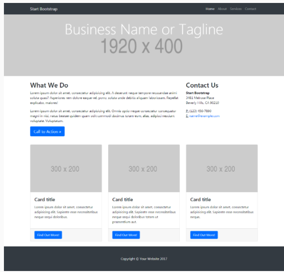

# MI PÁGINA
En este reto, vamos a realizar una página a nuestro gusto.

El diseño lo puedes realizar como mejor te parezca, pero debes mantener la estructura de la página y debes realizarlo con un grid (cualquiera pero que no sea un framework como Bootstrap o Materialize).

## Pseudocódigo para Mi página
1. Determinar la estructura de la página.
2. Hacer los estilos necesarios para media.

# El sitio debe verse como en la imagen:

